# Evaluating Coalition Stability in Federated Learning Under Voluntary Client Participation


---

## Requirements

Ensure you have the following Python packages installed:

```
matplotlib >= 3.10.3  
numpy >= 2.2.6  
pandas >= 2.2.3  
scikit-learn >= 1.6.1
```

>  **Note:** Earlier versions of these libraries might work but are not tested.

---


## Reproducing Results

* First Clone the Repository, then:


### 1. Datasets

#### Spambase Dataset

* Download the dataset from [UCI Spambase](https://archive.ics.uci.edu/static/public/94/spambase.zip).
* Extract and place the data files into the `data/` directory.

#### HuGaDB Dataset

* The HuGaDB dataset should be preprocessed using the code available at https://github.com/thomasmarchioro3/FederatedForestsWithDP.
Clone or copy the contents of the metadata directory from that repository into `data/HuGaDB/`, and ensure all files are placed correctly within the `data/` directory structure.
* The HuGaDB dataset is pre-partitioned for **18 clients**.


### 2. Federated Learning Experiments Without Low-Quality Clients (LQCs)

These commands reproduce results using default parameters:

* `--n_clients` is set to 10 by default.
* `--n_trials` is 1 for basic and 10 for evaluation(for each max iterations and max depth).
* `--max_iter` (also used as `max_depth` for decision trees) is set to 100.
* For HuGaDB, we use a sample size of 350 per client by default.

#### HuGaDB Dataset

```bash
python src/HuGaDB_Without_LQC.py basic --approach fedlr --model_type logistic
python src/HuGaDB_Without_LQC.py basic --approach fedfor --model_type decisiontree

python src/HuGaDB_Without_LQC.py evaluating --approach fedlr --model_type logistic
python src/HuGaDB_Without_LQC.py evaluating --approach fedlr --model_type decisiontree
```

#### Spambase Dataset

```bash
python src/Spambase_Without_LQC.py basic --approach fedlr --model_type logistic
python src/Spambase_Without_LQC.py basic --approach fedfor --model_type decisiontree

python src/Spambase_Without_LQC.py evaluating --approach fedlr --model_type logistic
python src/Spambase_Without_LQC.py evaluating --approach fedlr --model_type decisiontree
```

> **Note:** For Spambase, avoid significantly increasing the number of clients due to the limited dataset size.

--- 

Now, Run:

```bash
python src/fig1_shapley.py
```

To see:

<p align="center">
  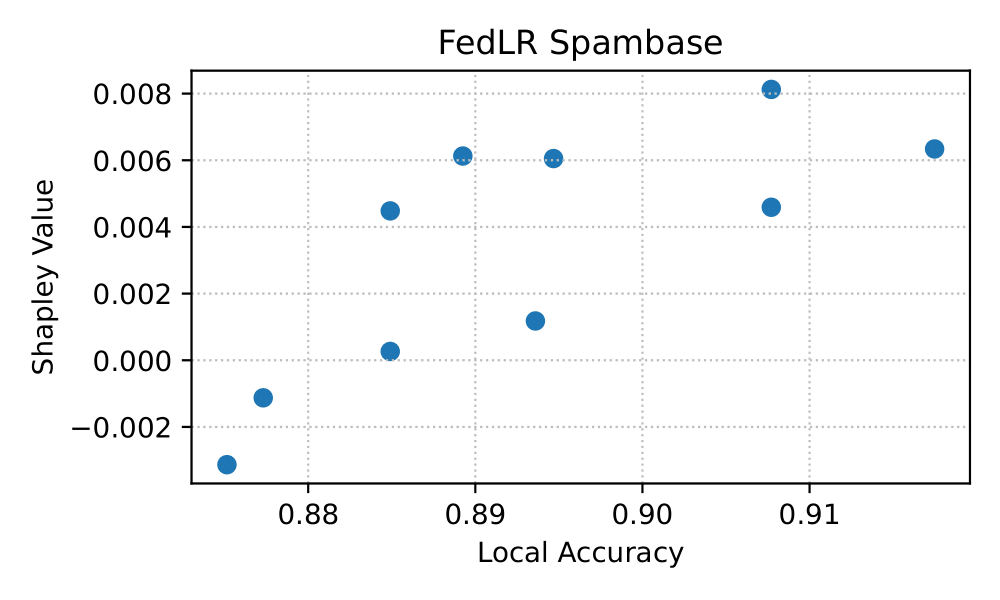
  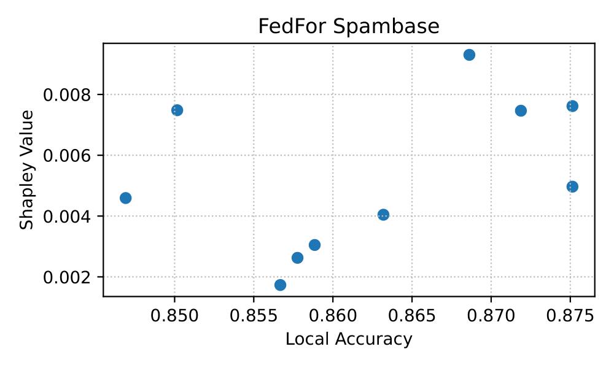
  <br>
  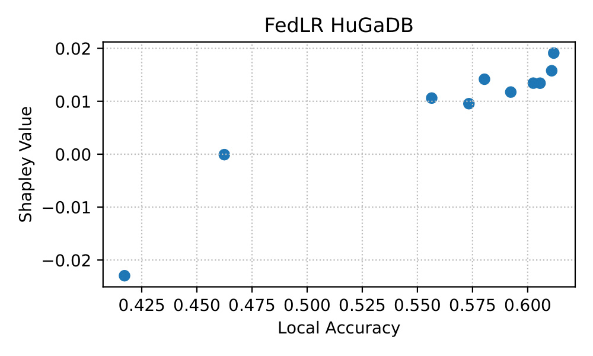
  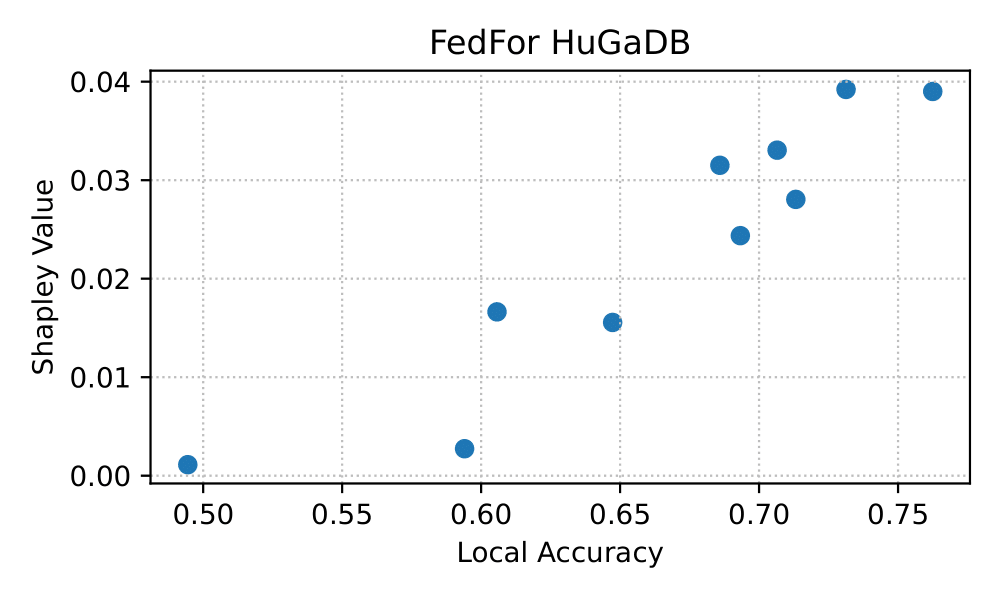
</p>

---

### 3. Experiments with LQCs

To explore the impact of LQCs, use the following parameters:

* `--n_clients`: number of clients (default: 10)
* `--hyper_params`: max iterations and max depth (default: `10,100`)
* `--n_trials`: number of trials (default: 50 trials for each max iterations and max depth )
* `--noise_stds`: list of noise standard deviations (default: `[0.1, 0.3, 0.5, 0.7, 1, 2, 3, 4, 5]`)
* `--corruption_prob`: probability of data corruption (default: 0.8)
* `--nan_prob`: probability of missing values (default: 0.5)
* `--label_corruption_prob`: probability of flipping labels (default: 0.2)
* `--sample_size`: number of samples per client just for HuGaDB(default: 350 )

If `--corrupted_clients` is not specified, the script defaults to running evaluations across all possible corruption configurations.(.i.e. 0 to `--n_clients`)

then you can run:


#### HuGaDB with LQCs

```bash
python src/HuGaDB_With_LQC.py --approach fedlr
python src/HuGaDB_With_LQC.py --approach fedfor
```

#### Spambase with LQCs

```bash
python src/Spambase_With_LQC.py --approach fedlr
python src/Spambase_With_LQC.py --approach fedfor
```

---


Now, Run:

```bash
python src/table1_ne_distribution.py
```

This output similar to the following table:


| Algorithm         | Nash Equilibrium   | Count | Global Accuracy (Std)     |
|------------------|--------------------|-------|-----------------------|
| **fedfor HuGaDB** | Grand coalition    | 99    | 0.7552 (0.0306)     |
|                  | Other coalitions   | 15    | 0.4432 (0.0665)     |
| **fedlr HuGaDB**  | Grand coalition    | 100   | 0.6641 (0.0093)     |
|                  | Other coalitions   | 30    | 0.4592 (0.0148)     |
| **fedfor Spambase** | Grand coalition | 99    | 0.9203 (0.0085)     |
|                  | Other coalitions   | 90    | 0.7532 (0.0859)     |
| **fedlr Spambase** | Grand coalition  | 95    | 0.9277 (0.0036)     |
|                  | Other coalitions   | 7     | 0.9153 (0.0079)     |


---


Run:

```bash
python src/fig2_ne_vs_lqc.py
```

To see:

<p align="center">
  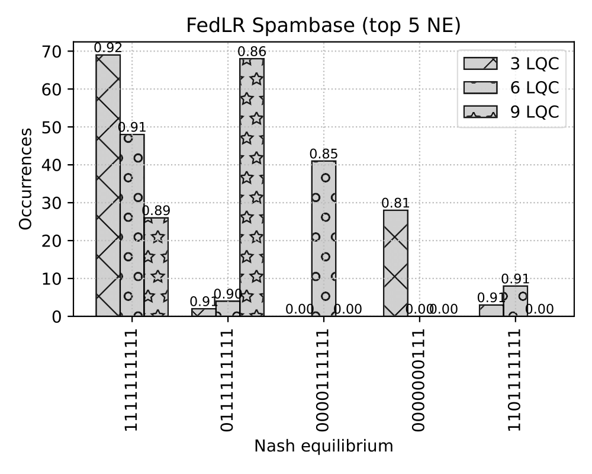
  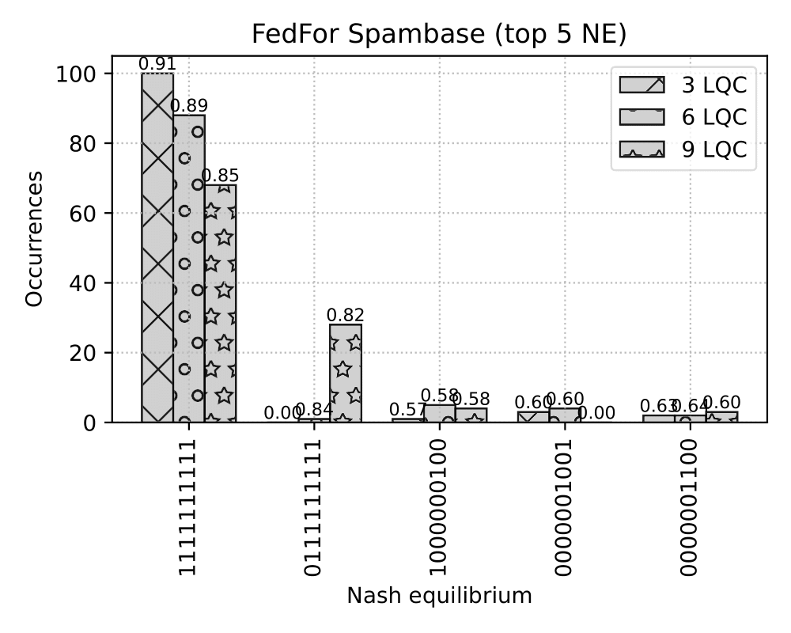
  <br>
  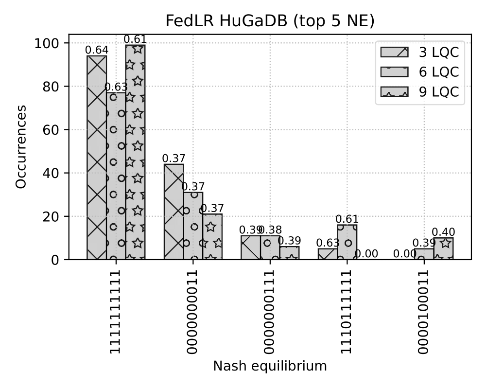
  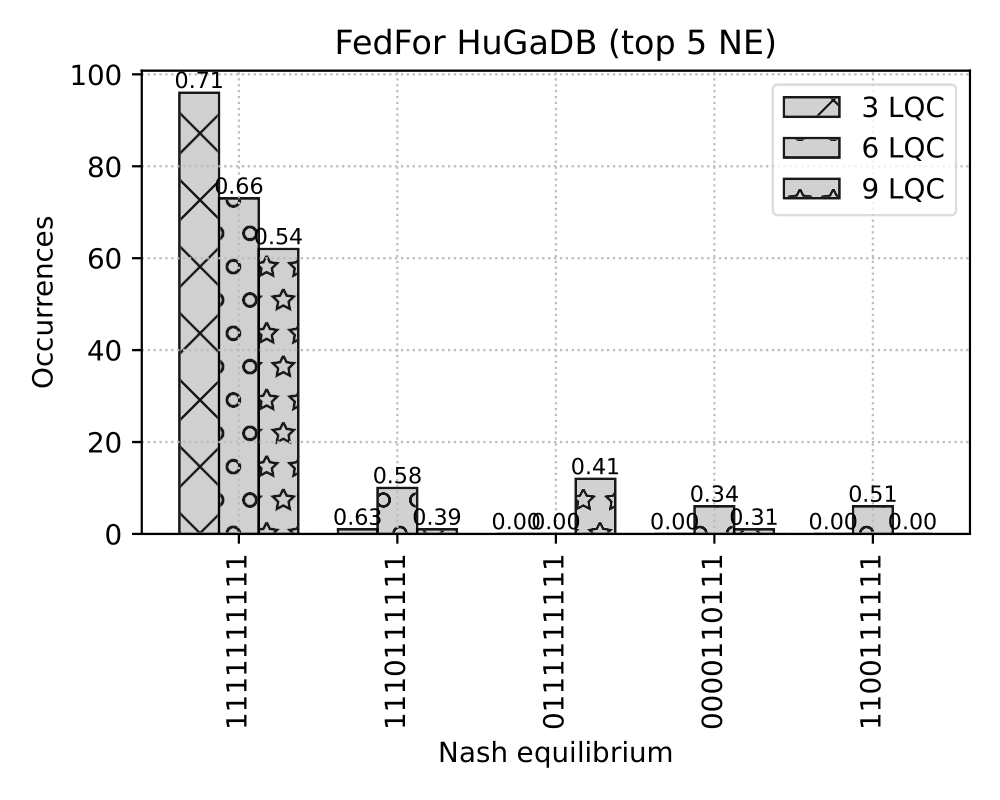
</p>


---

Run:

```bash
python src/fig3_grandcoalition_vs_lqc.py
```

To see:

<p align="center">
  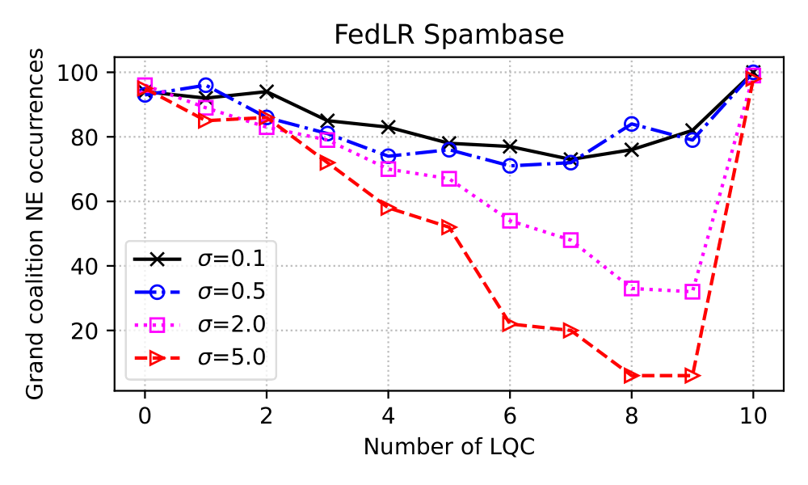
  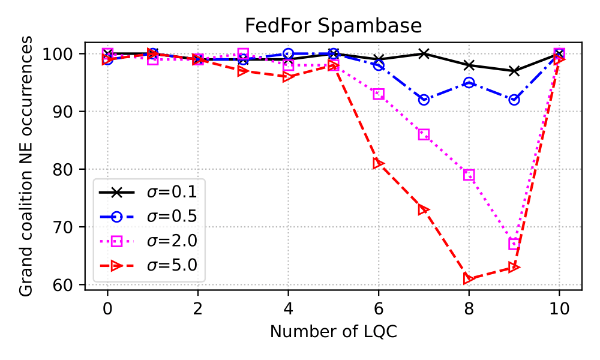
  <br>
  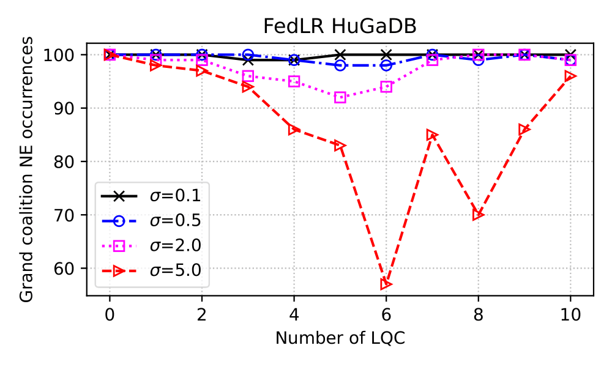
  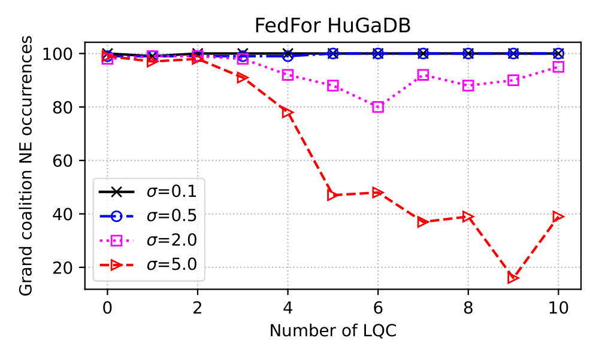
</p>


